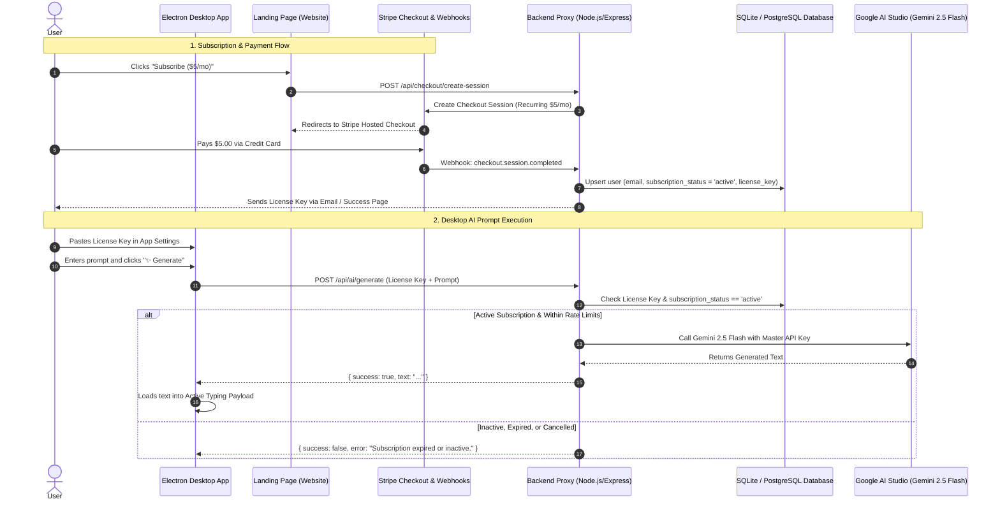

# Fake Worker — Monthly Subscription ($5/mo) & AI Proxy Implementation Plan

This document outlines the architecture, database schema, API design, and client-side changes required to implement recurring monthly billing ($5/month) for the **Cloud AI Pro** tier and securely proxy requests to Google Gemini 2.5 Flash.

---

## 1. System Architecture & Lifecycle



---

## 2. Stripe Configuration

### Products & Pricing
1. **Create Product in Stripe Dashboard**:
   - Name: `Fake Worker Cloud AI Pro`
   - Price: `$5.00 USD`
   - Billing period: `Monthly` (Recurring)
2. **Customer Portal**:
   - Turn on Stripe Customer Portal in Settings.
   - Allows users to cancel or update credit cards with zero custom frontend code needed.
3. **Webhook Events to Listen For**:
   - `checkout.session.completed`: User completed initial checkout $\rightarrow$ create license key.
   - `invoice.payment_succeeded`: Recurring payment succeeded $\rightarrow$ maintain `active` status.
   - `invoice.payment_failed`: Payment declined $\rightarrow$ update status to `past_due`.
   - `customer.subscription.deleted`: User cancelled $\rightarrow$ update status to `canceled`.

---

## 3. Backend Proxy Server Specifications

The backend should live in a `server/` directory or a separate repository (e.g. deployed on Render, Fly.io, Cloudflare, or Supabase).

### A. Database Schema
A single table in SQLite, PostgreSQL, or Supabase:

```sql
CREATE TABLE users (
  id TEXT PRIMARY KEY,                       -- UUID
  email TEXT UNIQUE NOT NULL,                -- User email
  stripe_customer_id TEXT UNIQUE,            -- Stripe Customer ID (cus_xxx)
  stripe_subscription_id TEXT UNIQUE,        -- Stripe Subscription ID (sub_xxx)
  subscription_status TEXT NOT NULL,         -- 'active', 'past_due', 'canceled', 'trialing'
  license_key TEXT UNIQUE NOT NULL,          -- e.g. 'FW-PRO-8F2B-9C1D-3A4E'
  current_period_end TIMESTAMP,              -- End date of current billing cycle
  created_at TIMESTAMP DEFAULT CURRENT_TIMESTAMP,
  updated_at TIMESTAMP DEFAULT CURRENT_TIMESTAMP
);

CREATE INDEX idx_users_license_key ON users(license_key);
```

### B. License Key Generator
```typescript
import crypto from 'crypto';

export function generateLicenseKey(): string {
  const parts = [];
  for (let i = 0; i < 4; i++) {
    parts.push(crypto.randomBytes(2).toString('hex').toUpperCase());
  }
  return `FW-PRO-${parts.join('-')}`; // e.g. FW-PRO-7A1C-9E2B-04F1-5C8D
}
```

### C. Stripe Webhook Handler (`POST /api/webhooks/stripe`)
```typescript
import express from 'express';
import Stripe from 'stripe';
import { db } from './db';
import { generateLicenseKey } from './utils';

const stripe = new Stripe(process.env.STRIPE_SECRET_KEY!, {
  apiVersion: '2023-10-16',
});

export const handleStripeWebhook = async (req: express.Request, res: express.Response) => {
  const sig = req.headers['stripe-signature'] as string;
  let event: Stripe.Event;

  try {
    event = stripe.webhooks.constructEvent(req.body, sig, process.env.STRIPE_WEBHOOK_SECRET!);
  } catch (err: any) {
    return res.status(400).send(`Webhook Signature Error: ${err.message}`);
  }

  switch (event.type) {
    case 'checkout.session.completed': {
      const session = event.data.object as Stripe.Checkout.Session;
      const email = session.customer_details?.email;
      const customerId = session.customer as string;
      const subscriptionId = session.subscription as string;

      if (email) {
        const licenseKey = generateLicenseKey();
        await db.upsertUser({
          email,
          stripeCustomerId: customerId,
          stripeSubscriptionId: subscriptionId,
          subscriptionStatus: 'active',
          licenseKey,
        });

        // Send email with license key via Resend / Postmark / SendGrid
      }
      break;
    }

    case 'customer.subscription.deleted': {
      const subscription = event.data.object as Stripe.Subscription;
      await db.updateStatusBySubscription(subscription.id, 'canceled');
      break;
    }

    case 'invoice.payment_failed': {
      const invoice = event.data.object as Stripe.Invoice;
      if (invoice.subscription) {
        await db.updateStatusBySubscription(invoice.subscription as string, 'past_due');
      }
      break;
    }
  }

  res.json({ received: true });
};
```

### D. AI Generation Proxy (`POST /api/ai/generate`)
```typescript
import { Request, Response } from 'express';
import { GoogleGenAI } from '@google/genai';
import { db } from './db';

const ai = new GoogleGenAI({ apiKey: process.env.GEMINI_MASTER_KEY! });

export const handleGenerateAI = async (req: Request, res: Response) => {
  const authHeader = req.headers.authorization;
  const licenseKey = authHeader?.replace('Bearer ', '').trim();
  const { prompt } = req.body;

  if (!licenseKey) {
    return res.status(401).json({ success: false, error: 'Missing License Key.' });
  }

g') {
    return res.status(400).json({ success: false, error: 'Valid prompt is required.' });
  // 1. Validate Subscription
  c}

  onst user = await db.getUserByLicenseKey(licenseKey);
  if (!user || user.subscription_status !== 'active') {
    return res.status(403).json({
      success: false,
      error: 'Subscription inactive or invalid license key. Please check your billing at fakeworker.app.',
    });
  }

  // 2. Call Google Gemini 2.5 Flash using Server's Master Key
  try {
    const response = await ai.models.generateContent({
      model: 'gemini-2.5-flash',
      contents: prompt,
    });

    return res.json({
      success: true,
      text: response.text || '',
    });
  } catch (err: any) {
    console.error('Gemini Master Proxy Error:', err);
    return res.status(500).json({
      success: false,
      error: 'Upstream AI provider error. Please try again.',
    });
  }
};
```

---

## 4. Desktop Client Changes (`src/`)

### A. UI Configuration ([src/index.html](file:///c:/Users/jotam/projects/fake-worker/src/index.html))
Add an option to toggle between:
1. **BYO Gemini API Key** (Free / Lifetime tier)
2. **Cloud AI License Key** ($5/mo tier)

```html
<div class="auth-mode-selector">
  <label><input type="radio" name="authMode" value="license" checked /> Cloud AI License Key ($5/mo)</label>
  <label><input type="radio" name="authMode" value="apikey" /> BYO Gemini API Key</label>
</div>

<div class="key-input-wrapper">
  <input
    type="text"
    id="licenseKeyInput"
    placeholder="Enter your Cloud AI License Key (e.g. FW-PRO-XXXX-...)"
  />
  <input
    type="password"
    id="apiKeyInput"
    placeholder="Enter your personal Gemini API Key"
    style="display: none;"
  />
</div>
```

### B. IPC Handler Update ([src/main.ts](file:///c:/Users/jotam/projects/fake-worker/src/main.ts))
In `src/main.ts`, update `generate-ai`:
```typescript
ipcMain.handle('generate-ai', async (_event, args: {
  authMode: 'license' | 'apikey';
  licenseKey?: string;
  apiKey?: string;
  prompt: string;
}) => {
  if (args.authMode === 'license') {
    // Call our backend proxy
    const response = await fetch('https://api.fakeworker.app/api/ai/generate', {
      method: 'POST',
      headers: {
        'Content-Type': 'application/json',
        'Authorization': `Bearer ${args.licenseKey}`,
      },
      body: JSON.stringify({ prompt: args.prompt }),
    });
    const data = await response.json();
    return data;
  } else {
    // Call Gemini directly with user's personal key
    const ai = new GoogleGenAI({ apiKey: args.apiKey || process.env.GEMINI_API_KEY });
    const response = await ai.models.generateContent({
      model: 'gemini-2.5-flash',
      contents: args.prompt,
    });
    return { success: true, text: response.text || '' };
  }
});
```

---

## 5. Profit Margins & Unit Economics ($5.00 / month)

| Item | Cost Per User / Month | Remaining Margin |
| :--- | :--- | :--- |
| **Gross Subscription Revenue** | **$5.00** | 100% |
| **Stripe Fee** ($0.30 + 2.9%) | ~$0.45 | $4.55 |
| **Gemini 2.5 Flash Token Cost** (150 prompts / ~200,000 tokens) | ~$0.05 | $4.50 |
| **Server Overhead** (Edge / Serverless) | ~$0.02 | **~$4.48 Net Profit** |

**Net Margin: ~89%**.

---

## 6. Implementation Steps Checklist

- [ ] **Step 1**: Set up Stripe account & create recurring product ($5.00/mo).
- [ ] **Step 2**: Create backend repository (`server/`) with Express + `@google/genai` + `stripe`.
- [ ] **Step 3**: Implement SQLite/PostgreSQL database with `users` table.
- [ ] **Step 4**: Implement `/api/webhooks/stripe` with signature verification.
- [ ] **Step 5**: Implement `/api/ai/generate` proxy validating active license keys.
- [ ] **Step 6**: Update Desktop UI to support License Key storage & proxy IPC calls.
- [ ] **Step 7**: Update landing page checkout button to link to Stripe Checkout.
